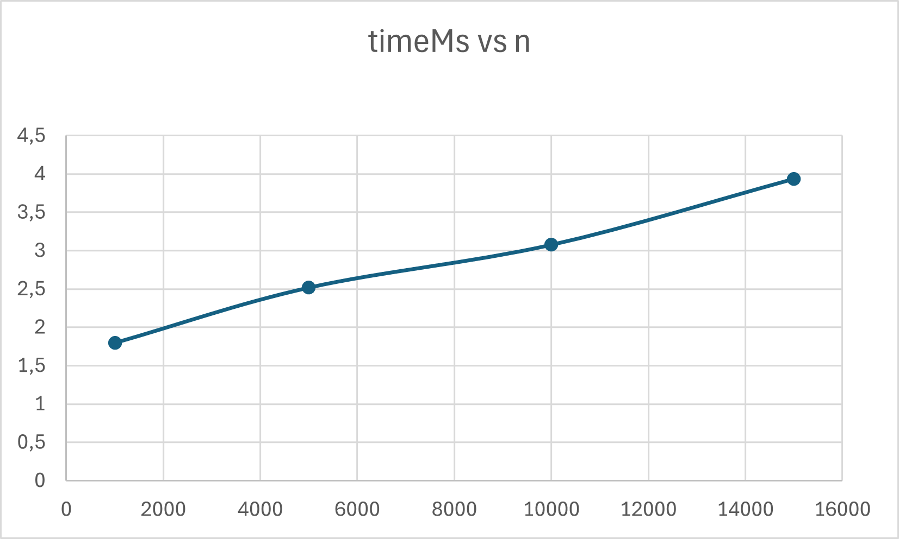
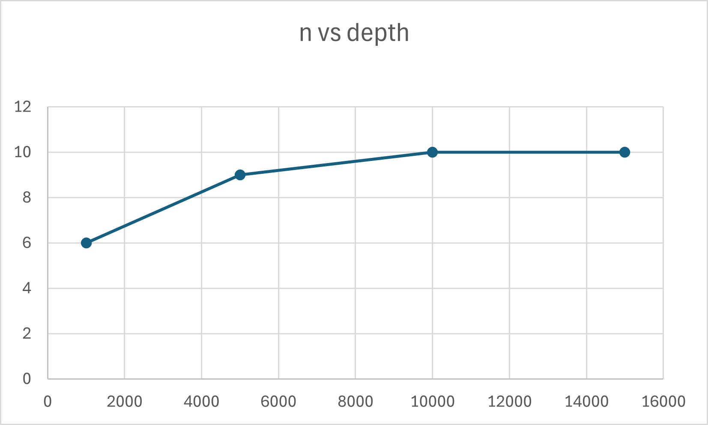

java -cp "assignment1\target\classes" com.arlask.CLI mergesort 1000#Design and Analysis of Algorithms Assignment 1

This project provides a few divide-and-conquer algorithms with classes for collecting metrics such as time, recursion depth, and comparisons.

##Implemented Algorithms

Merge Sort - sort with reusable buffer, cutoff O(nlogn)
Quick Sort - randomized pivot, worst-case O(n^2)
Closest Pair of Points - divide-and-conquer algorithm, O(nlogn)
Deterministic select - divide-and-conquer algorithm, selects the k-th smallest element in linear time O(n)

###Metrics and instruments:

incComparisons and incSwaps - tracks comparisons and swaps in algoritms

enterRec and leaveRec - tracks recursion depth

Logger - writes results to CSV file

Algorithm tests writes results to 'results.csv'

####Algorithm analysis:

- Master theorem:
T(n) = aT(n/b) + f(n)
where:
n - size of input
a - number of subproblems
b - size reduction
f(n) - non-recursive overhead

- Merge Sort:
a = 2
b = 2
T(n) = 2T(n/2) + O(n)=n  * log n =Θ(nlogn)

n^logb(a)= n
f(n) = n^logb(a)

- Quick Sort:

T(n) = 2T(n/2) +O(n)=n  * log n =Θ(nlogn)

n^logb(a)= n
f(n) = n^logb(a)

Worst case:Θ(n^2)

- Deterministic Select:

T(n) = T(n/5) + T(7n/10) + O(n)

- Closest pair

T(n) = 2T(n/2) + O(n) = Θ(nlogn)

